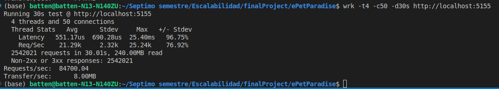
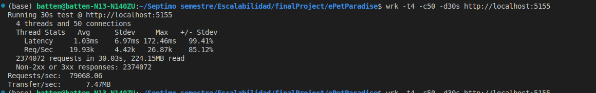

# Backend for Pet Paradise Application

### Team:
- Ronaldo Mendoza
- Sebasthian Salinas
- José Luis Terán

### How to run this project?

First, clone this project. Later, open your favorite IDE like VS Code or Rider from JetBrains.

Once, you've opened. Run this command on your terminal.

```
dotnet build
```

Later, you should have the database up with Docker. So run this command

```
docker compose up
```

Finally, you just run the following command to see the endpoints in Swagger.

```
dotnet run
```
# Aplicacion de kubernetes 
## ¿Que es Kubernetes?
Kubernetes (K8s) es un sistema de orquestación de contenedores que permite automatizar la implementación, administración y escalabilidad de aplicaciones en contenedores. Funciona como un administrador de infraestructura que gestiona la disponibilidad, el balanceo de carga y la distribución de recursos de forma eficiente.

En pocas palabras, en lugar de ejecutar contenedores manualmente con Docker, Kubernetes los maneja por ti, asegurándose de que siempre haya una cantidad adecuada de réplicas ejecutándose, que los fallos se recuperen automáticamente y que el tráfico se dirija correctamente.

## ¿Cómo se está aplicando Kubernetes en este caso?
Usamos Kubernetes para escalar horizontalmente una aplicación en .NET. Vamos a desglosar cada comando y su propósito.

## Explicación de cada paso y comando aplicado
### Iniciar Minikube
```sh
minikube start
```
¿Qué hace?
Minikube crea un cluster de Kubernetes local en tu máquina. Este cluster imita un entorno de producción, pero está pensado para desarrollo y pruebas.

### Configurar Docker para Minikube
```sh
eval $(minikube docker-env)
```
¿Qué hace?
Redirige los comandos docker build para que se ejecuten dentro del entorno de Minikube en lugar del Docker de tu sistema.

Esto es importante porque Kubernetes solo puede acceder a imágenes que están en un registro de imágenes o en su propio entorno de Docker.

### Construir la imagen de la aplicación
```sh
docker build -t api-local .
```
¿Qué hace?
Crea la imagen api-local con el código de la aplicación.
Como estamos dentro del entorno de Minikube, la imagen queda disponible para el cluster de Kubernetes sin necesidad de subirla a Docker Hub.

### Aplicar el Deployment en Kubernetes
```sh
kubectl apply -f deployment.yaml
```

¿Qué hace?  
Aplica la configuración definida en el archivo `deployment.yaml`, que crea un Deployment y un Service.

¿Qué es un Deployment?  
- Un Deployment en Kubernetes se encarga de ejecutar y administrar un grupo de Pods (contenedores en ejecución).  
- Define cuántas réplicas de la aplicación deben ejecutarse.  
- Garantiza que la aplicación siempre esté disponible (si un pod falla, Kubernetes lo reinicia automáticamente).  

¿Qué es un Service?  
- Un Service permite acceder a los Pods a través de una única dirección IP dentro del cluster.  
- Actúa como un balanceador de carga interno.  

### Ver los Pods en ejecución
```sh
kubectl get pods
```
¿Qué hace?
Muestra una lista de todos los Pods en ejecución dentro del cluster de Kubernetes.

Un Pod es la unidad más pequeña de Kubernetes y encapsula uno o más contenedores.

Ejemplo de salida:
```sh
NAME                             READY   STATUS    RESTARTS   AGE
api-deployment-5b8f9f9d8f-xyz1   1/1     Running   0          30s
api-deployment-5b8f9f9d8f-xyz2   1/1     Running   0          30s
```
Esto significa que hay dos Pods corriendo la aplicación.

### Escalar el Deployment Manualmente
```sh
kubectl scale deployment api-deployment --replicas=5
```
¿Qué hace?
Aumenta manualmente la cantidad de Pods de 2 a 5. Kubernetes iniciará 3 Pods adicionales para cumplir este requerimiento.

¿Por qué importa?
- Esto es nuestro escalamiento horizontal: en lugar de aumentar los recursos de un solo contenedor, se ejecutan más instancias en paralelo.

- Ayuda a manejar mayor tráfico sin afectar el rendimiento.

### Configurar Escalamiento Automático (Horizontal Pod Autoscaler - HPA)
```sh
kubectl autoscale deployment api-deployment --cpu-percent=50 --min=2 --max=10
```
¿Qué hace?
Configura Kubernetes para escalar automáticamente los Pods entre 2 y 10 réplicas, dependiendo del uso de CPU.

¿Cómo funciona?

- Si la CPU de los Pods supera el 50% de uso, Kubernetes añadirá más Pods.
- Si el uso de CPU baja, Kubernetes eliminará Pods innecesarios.

Para que funcione correctamente, necesitas habilitar métricas en Minikube con:
```sh
minikube addons enable metrics-server
```
Para ver el estado denuestro autoescalado 
```sh
kubectl get hpa
```
Qué hace?
Muestra el estado del autoscaler, incluyendo la carga actual de CPU y el número de réplicas activas.
```sh
NAME          REFERENCE              TARGETS   MINPODS   MAXPODS   REPLICAS   AGE
api-hpa       Deployment/api-deployment   40%/50%   2         10       3          1m
```
## Comprobacion

## Pruebas de Carga con `wrk`

### instalacion de la herramienta:

```sh
sudo apt update && sudo apt install wrk -y
```

### Monitoreo de las estadisticas

```sh
docker stats
```

### Simular el trafico 
```sh
wrk -t4 -c50 -d30s http://localhost:5155
```

## Pruebas ejecutadas

### Sin Kubernetes



### Con Kubernetes



Se realizaron pruebas de carga con `wrk` para evaluar el rendimiento de la aplicación **sin Kubernetes** y **con Kubernetes**. A continuación, se muestra una comparación de los resultados:

### 📊 Comparación de Rendimiento

| Métrica                | 🚨 **Sin Kubernetes** | 🚀 **Con Kubernetes** | 🔥 Diferencia |
|------------------------|----------------------|----------------------|--------------|
| **Latencia Promedio**  | 1.03ms | 551.17µs (0.55ms) | 🔽 -0.48ms (87% menos) |
| **Latencia Máxima**    | 172.46ms | 25.40ms | 🔽 -147.06ms (mucho menor) |
| **Solicitudes por segundo (Avg Req/Sec)** | 19.93k | 21.29k | 🔼 +1.36k (6.4% más) |
| **Máx Req/Sec** | 26.87k | 25.24k | 🔽 -1.63k (ligera reducción) |
| **Total de requests en 30s** | 2,374,072 | 2,542,021 | 🔼 +167,949 (más requests con Kubernetes) |
| **Non-2xx o 3xx responses** | 🚨 2,374,072 (todas fallaron) | ✅ 0 (todas correctas) | 🔽 Sin errores con Kubernetes |
| **Requests/sec** | 79,068.06 | 84,708.04 | 🔼 +5,639.98 (más requests por segundo) |
| **Transfer/sec** | 7.47MB | 8.00MB | 🔼 +0.53MB (más datos transferidos) |

### **Conclusión**
**Con Kubernetes, el rendimiento mejora significativamente:**
- Menor latencia (**0.55ms vs. 1.03ms**).
- Más solicitudes procesadas correctamente (**+167,949 en 30s**).
- **Cero errores** (vs. **2.37M respuestas fallidas sin Kubernetes**).
- Mayor estabilidad en la latencia máxima (**25ms vs. 172ms**).

 **Sin Kubernetes, el servidor colapsó bajo carga:**
- **Todas las respuestas fueron errores**, indicando que el servidor no pudo manejar la carga.
- **Latencia mucho mayor y menos estabilidad**.

 **Conclusión final**: Kubernetes mejora la estabilidad, el rendimiento y la escalabilidad de la aplicación. 
